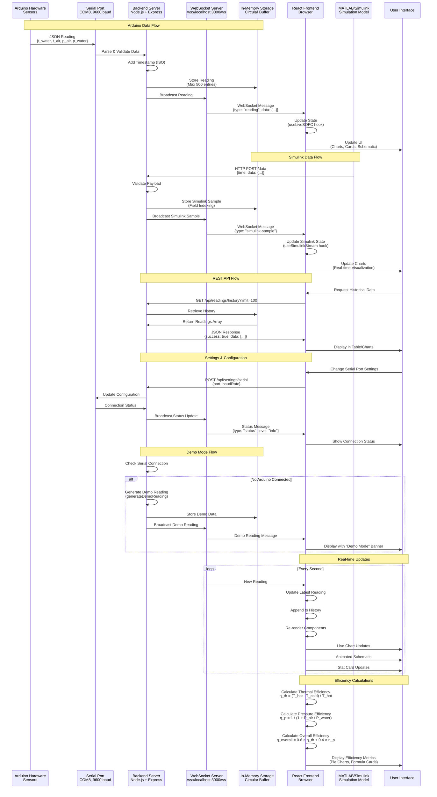

# SOFC-SCADA Dashboard - Architecture Diagrams

## 1. Backend Architecture Diagram

```mermaid
graph TB
    subgraph "Entry Point"
        A[index.ts<br/>Main Server Entry]
    end
    
    subgraph "HTTP Server Layer"
        B[Express App<br/>REST API]
        C[HTTP Server<br/>createServer]
        D[CORS Middleware]
        E[JSON Parser]
    end
    
    subgraph "WebSocket Layer"
        F[WebSocket Server<br/>ws://localhost:3000/ws]
        G[broadcastReading]
        H[broadcastStatus]
        I[broadcastSimulinkSample]
    end
    
    subgraph "Serial Communication"
        J[Serial Port Module<br/>serial.ts]
        K[initSerial]
        L[updateSerialConfig]
        M[listSerialPorts]
        N[SerialPort Library<br/>9600 baud]
    end
    
    subgraph "Data Storage"
        O[Storage Module<br/>storage.ts]
        P[getLatestReading]
        Q[getReadingsHistory<br/>Circular Buffer 500]
        R[In-Memory Storage]
    end
    
    subgraph "Simulink Integration"
        S[Simulink Stream<br/>simStream.ts]
        T[addSimulinkSample]
        U[getSimulinkHistory]
        V[getSimulinkFields]
        W[Field Indexing]
    end
    
    subgraph "Mock Data Generation"
        X[Mock Data Module<br/>mockData.ts]
        Y[generateDemoReading]
        Z[generateMockSofcMetrics]
        AA[generateMockIVCurve]
    end
    
    subgraph "Type Definitions"
        AB[types.ts<br/>TypeScript Interfaces]
    end
    
    subgraph "External Systems"
        AC[Arduino Hardware<br/>Serial Port COM8]
        AD[MATLAB/Simulink<br/>HTTP POST /data]
        AE[Frontend Client<br/>WebSocket + REST]
    end
    
    subgraph "API Endpoints"
        AF[GET /api/readings/latest]
        AG[GET /api/readings/history]
        AH[GET /api/status]
        AI[GET /api/ports]
        AJ[POST /api/settings/serial]
        AK[POST /data<br/>Simulink Endpoint]
        AL[GET /api/sim/history]
        AM[GET /api/sim/latest]
        AN[GET /api/sim/fields]
    end
    
    A --> B
    A --> C
    B --> D
    B --> E
    C --> F
    F --> G
    F --> H
    F --> I
    
    A --> J
    J --> K
    J --> L
    J --> M
    J --> N
    N --> AC
    
    A --> O
    O --> P
    O --> Q
    O --> R
    
    A --> S
    S --> T
    S --> U
    S --> V
    S --> W
    
    A --> X
    X --> Y
    X --> Z
    X --> AA
    
    J --> O
    S --> O
    
    B --> AF
    B --> AG
    B --> AH
    B --> AI
    B --> AJ
    B --> AK
    B --> AL
    B --> AM
    B --> AN
    
    AF --> O
    AG --> O
    AK --> S
    AL --> S
    AM --> S
    AN --> S
    
    G --> F
    H --> F
    I --> F
    F --> AE
    
    K --> G
    T --> I
    Y --> G
    
    style A fill:#4A70A9,stroke:#333,stroke-width:3px,color:#fff
    style B fill:#8FABD4,stroke:#333,stroke-width:2px
    style F fill:#8FABD4,stroke:#333,stroke-width:2px
    style J fill:#F59E0B,stroke:#333,stroke-width:2px
    style O fill:#10B981,stroke:#333,stroke-width:2px
    style S fill:#8B5CF6,stroke:#333,stroke-width:2px
    style AC fill:#EF4444,stroke:#333,stroke-width:2px,color:#fff
    style AD fill:#EF4444,stroke:#333,stroke-width:2px,color:#fff
    style AE fill:#3B82F6,stroke:#333,stroke-width:2px,color:#fff
```

## 2. Frontend Architecture Diagram

```mermaid
graph TB
    subgraph "Application Entry"
        A[main.tsx<br/>ReactDOM Root]
        B[App.tsx<br/>Router Configuration]
    end
    
    subgraph "Routing Layer"
        C[React Router DOM]
        D[ProtectedRoute<br/>Auth Guard]
        E[Layout Component<br/>Wrapper]
    end
    
    subgraph "Context Providers"
        F[AuthContext<br/>User Authentication]
        G[ThemeContext<br/>Dark/Light Mode]
        H[QueryClientProvider<br/>React Query]
    end
    
    subgraph "Layout Components"
        I[Header<br/>Connection Status]
        J[Sidebar<br/>Navigation]
        K[Footer]
        L[Layout.tsx<br/>Main Wrapper]
    end
    
    subgraph "Feature Pages"
        M[Dashboard<br/>Real-time Monitoring]
        N[Analytics<br/>Efficiency Metrics]
        O[Schematic View<br/>Animated Diagram]
        P[Simulink Page<br/>Simulation Data]
        Q[Reports<br/>PDF Generation]
        R[Logs<br/>Data Search]
        S[Settings<br/>Configuration]
        T[User Activity]
        U[Login/Register<br/>Authentication]
    end
    
    subgraph "Shared Components"
        V[Card<br/>Container Component]
        W[StatCard<br/>Metric Display]
        X[Charts<br/>Recharts Components]
        Y[Schematic<br/>Basic Diagram]
    end
    
    subgraph "Custom Hooks"
        Z[useLiveSOFC<br/>WebSocket Hook]
        AA[useThresholds<br/>Threshold Check]
        AB[useSimulinkStream<br/>Simulink Data]
        AC[useRecentHistory<br/>Time Filter]
    end
    
    subgraph "Data Layer"
        AD[WebSocket Client<br/>ws://localhost:3000/ws]
        AE[React Query<br/>Data Fetching]
        AF[Local State<br/>useState/useReducer]
    end
    
    subgraph "Chart Components"
        AG[TemperatureChart<br/>Area Chart]
        AH[PressureChart<br/>Line Chart]
        AI[IVCurveChart<br/>Dual Axis]
        AJ[HistogramChart<br/>Bar Chart]
        AK[PieChart<br/>Distribution]
    end
    
    subgraph "External Libraries"
        AL[Recharts<br/>Charting]
        AM[jsPDF<br/>PDF Generation]
        AN[Lucide Icons<br/>Icon Library]
        AO[Tailwind CSS<br/>Styling]
        AP[Three.js<br/>3D Visualization]
    end
    
    subgraph "Backend Communication"
        AQ[REST API<br/>HTTP Requests]
        AR[WebSocket<br/>Real-time Stream]
    end
    
    A --> B
    B --> C
    C --> D
    D --> E
    E --> L
    
    B --> F
    B --> G
    B --> H
    
    L --> I
    L --> J
    L --> K
    L --> M
    L --> N
    L --> O
    L --> P
    L --> Q
    L --> R
    L --> S
    L --> T
    
    C --> U
    
    M --> V
    M --> W
    M --> X
    M --> Y
    N --> V
    N --> X
    O --> V
    O --> AK
    P --> V
    P --> X
    Q --> V
    Q --> AM
    R --> V
    
    M --> Z
    M --> AA
    M --> AC
    P --> AB
    S --> Z
    
    Z --> AD
    AB --> AD
    AD --> AR
    
    AE --> AQ
    M --> AE
    N --> AE
    Q --> AE
    R --> AE
    
    X --> AG
    X --> AH
    X --> AI
    X --> AJ
    O --> AK
    
    AG --> AL
    AH --> AL
    AI --> AL
    AJ --> AL
    AK --> AL
    
    V --> AN
    W --> AN
    I --> AN
    J --> AN
    
    V --> AO
    W --> AO
    M --> AO
    N --> AO
    
    style A fill:#4A70A9,stroke:#333,stroke-width:3px,color:#fff
    style B fill:#4A70A9,stroke:#333,stroke-width:2px,color:#fff
    style C fill:#8FABD4,stroke:#333,stroke-width:2px
    style F fill:#10B981,stroke:#333,stroke-width:2px
    style G fill:#10B981,stroke:#333,stroke-width:2px
    style Z fill:#F59E0B,stroke:#333,stroke-width:2px
    style AD fill:#EF4444,stroke:#333,stroke-width:2px,color:#fff
    style AR fill:#EF4444,stroke:#333,stroke-width:2px,color:#fff
    style AQ fill:#3B82F6,stroke:#333,stroke-width:2px,color:#fff
```

## 3. Data Flow Diagram

```mermaid
sequenceDiagram
    participant Arduino as Arduino Hardware<br/>Sensors
    participant Serial as Serial Port<br/>COM8, 9600 baud
    participant Backend as Backend Server<br/>Node.js + Express
    participant WS as WebSocket Server<br/>ws://localhost:3000/ws
    participant Storage as In-Memory Storage<br/>Circular Buffer
    participant Frontend as React Frontend<br/>Browser
    participant Simulink as MATLAB/Simulink<br/>Simulation Model
    participant User as User Interface
    
    Note over Arduino,Storage: Arduino Data Flow
    Arduino->>Serial: JSON Reading<br/>{t_water, t_air, p_air, p_water}
    Serial->>Backend: Parse & Validate Data
    Backend->>Backend: Add Timestamp (ISO)
    Backend->>Storage: Store Reading<br/>(Max 500 entries)
    Backend->>WS: Broadcast Reading
    WS->>Frontend: WebSocket Message<br/>{type: "reading", data: {...}}
    Frontend->>Frontend: Update State<br/>(useLiveSOFC hook)
    Frontend->>User: Update UI<br/>(Charts, Cards, Schematic)
    
    Note over Simulink,Storage: Simulink Data Flow
    Simulink->>Backend: HTTP POST /data<br/>{time, data: {...}}
    Backend->>Backend: Validate Payload
    Backend->>Storage: Store Simulink Sample<br/>(Field Indexing)
    Backend->>WS: Broadcast Simulink Sample
    WS->>Frontend: WebSocket Message<br/>{type: "simulink-sample"}
    Frontend->>Frontend: Update Simulink State<br/>(useSimulinkStream hook)
    Frontend->>User: Update Charts<br/>(Real-time Visualization)
    
    Note over Frontend,Backend: REST API Flow
    User->>Frontend: Request Historical Data
    Frontend->>Backend: GET /api/readings/history?limit=100
    Backend->>Storage: Retrieve History
    Storage->>Backend: Return Readings Array
    Backend->>Frontend: JSON Response<br/>{success: true, data: [...]}
    Frontend->>User: Display in Table/Charts
    
    Note over Frontend,Backend: Settings & Configuration
    User->>Frontend: Change Serial Port Settings
    Frontend->>Backend: POST /api/settings/serial<br/>{port, baudRate}
    Backend->>Serial: Update Configuration
    Serial->>Backend: Connection Status
    Backend->>WS: Broadcast Status Update
    WS->>Frontend: Status Message<br/>{type: "status", level: "info"}
    Frontend->>User: Show Connection Status
    
    Note over Backend,Storage: Demo Mode Flow
    Backend->>Backend: Check Serial Connection
    alt No Arduino Connected
        Backend->>Backend: Generate Demo Reading<br/>(generateDemoReading)
        Backend->>Storage: Store Demo Data
        Backend->>WS: Broadcast Demo Reading
        WS->>Frontend: Demo Reading Message
        Frontend->>User: Display with "Demo Mode" Banner
    end
    
    Note over Frontend,User: Real-time Updates
    loop Every Second
        WS->>Frontend: New Reading
        Frontend->>Frontend: Update Latest Reading
        Frontend->>Frontend: Append to History
        Frontend->>Frontend: Re-render Components
        Frontend->>User: Live Chart Updates
        Frontend->>User: Animated Schematic
        Frontend->>User: Stat Card Updates
    end
    
    Note over Frontend,User: Efficiency Calculations
    Frontend->>Frontend: Calculate Thermal Efficiency<br/>η_th = (T_hot - T_cold) / T_hot
    Frontend->>Frontend: Calculate Pressure Efficiency<br/>η_p = 1 / (1 + P_air / P_water)
    Frontend->>Frontend: Calculate Overall Efficiency<br/>η_overall = 0.6 × η_th + 0.4 × η_p
    Frontend->>User: Display Efficiency Metrics<br/>(Pie Charts, Formula Cards)
```
